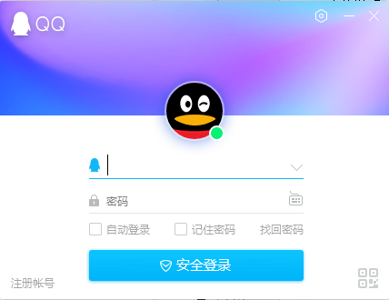
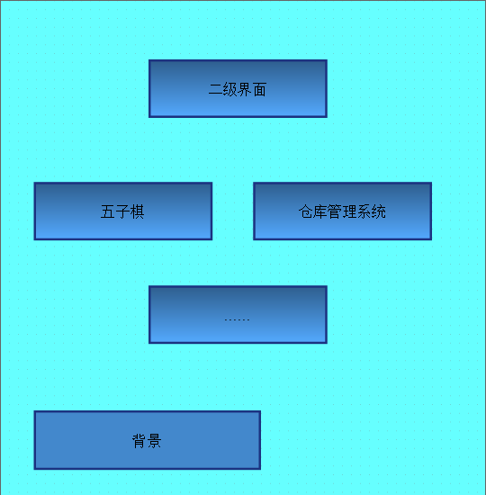
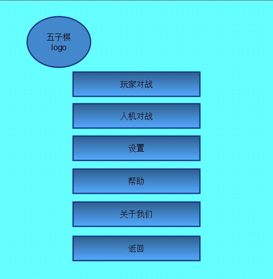

五子棋projiect/GoBang

1. 功能说明
    
    (1 )客户端启动后进入一级图形界面,包含登陆及注册功能
        
        
        (图片仅供参考)
        
    (2) 用户可以通过客户端登陆或注册
    
        *用户名不能重复
        *用户注册必填用户名和密码，其他内容不限
        *用户注册信息需长期保存
        *用户凭用户名及密码登陆
    (3) 注册成功即返回一级界面登陆,退出即退出客户端,
        登陆成功进入二级界面
        
        
        (二级界面,增加注销功能)
        
    (4) 二级界面包含本项目所有产品,如五子棋、仓库管理系统等
    
    (5) 选择任意一款产品,进入相应的三级界面,以五子棋为例
        
        
        (五子棋选项界面)
        
    (6) 玩家对战模式(主要功能)
    
        * 准备状态下才可进入对局状态
        * 对局包含认输,悔棋功能
        * 五连珠胜利
  
2.工具选择

    (1) 编辑器:pycharm
    (2) 图形界面:PyQt5
    (3) 并发方案:多进程并发,创建子进程,tcp套接字,用户注册信心采用mysql存储